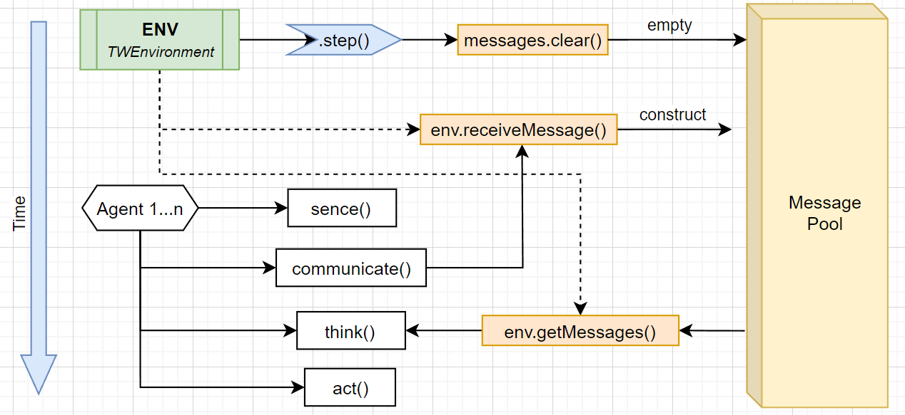

# Agent Communication Protocol

本文档描述当前仓库里实际在跑的智能体通信协议。
>版本号：G7P1    _// Group7 Protocol v1_

---

## 1. 一图总览

### 1.1 通信拓扑

```text
Agent 1 (communicate) ─┐
                       ├──> TWEnvironment.messages (broadcast channel, ArrayList<Message>)
Agent N (communicate) ─┤
                       └──> TWEnvironment.messages(...)
                       ...

随后每个 Agent 在 think() 中统一读取:
for (Message m : env.getMessages()) { ... }
```

要点:
- 当前通讯基于广播，不是点对点路由。
- `Message.to` 当前固定写 `ALL`，接收侧也按广播处理。
- 每个 step 开头TW环境会 `messages.clear()`，消息只在当步有效。

### 1.2 每个 Step 的时序



对应调度顺序:
- order 1: `TWEnvironment.step()`（清消息）
- order 2: `agent.sense(); agent.communicate();`
- order 3: `agent.step()` -> `think(); act();`

---

## 2. 报文格式

## 2.1 外层 Message 容器

`Message` 类字段:
- `from`
- `to`
- `message` (真正协议字符串)

## 2.2 协议字符串格式

```text
G7P1|step|from|to|type|x|y|payload
```

字段定义:

| 字段 | 说明 | 示例 |
|---|---|---|
| `G7P1` | 协议版本 | `G7P1` |
| `step` | 仿真步数 | `128` |
| `from` | 发送者名字 | `Hanny - Agent2` |
| `to` | 目标（当前固定为广播） | `ALL` |
| `type` | 消息类型码 | `SS` |
| `x`,`y` | 事件/观测坐标 | `17`,`24` |
| `payload` | 可选负载 | `T,17,24;E,17,25` |

注意:
- 分隔符是 `|`。
- payload 中若出现 `|` 会被替换成 `/`（发送端做了 sanitize）。
- 解析时按最多 8 段 split，payload 可为空。

---

## 3. Type Code 速查表 （不同Agent可以定义自己的）

| Type | 全名 | 谁发 | 触发时机 | 典型用途 |
|---|---|---|---|---|
| `NT` | `OBS_NEW_TILE` | Base | 首次看到 tile | 队友补充 tile 记忆 |
| `NH` | `OBS_NEW_HOLE` | Base | 首次看到 hole | 队友补充 hole 记忆 |
| `OB` | `OBS_OBSTACLE` | Base | 首次看到 obstacle | 队友补充障碍记忆 |
| `FS` | `OBS_FUEL_ONCE` | Base | 每个 agent 首次看到油站 | 共享油站位置 |
| `PK` | `ACTION_PICKUP_TILE` | Base | pickup 成功后 | 队友清理该 tile 记忆 |
| `FH` | `ACTION_FILL_HOLE` | Base | fill 成功后 | 队友清理该 hole 记忆 |
| `SS` | `OBS_SENSOR_SNAPSHOT` | AgentHanny | 每步 1 条 | 广播完整局部快照(含Empty Grid) |

补充:
- `NT/NH/OB` 是“首次发现”语义，基于 `announcedObjectKeys` 去重，不会每步重复发。
- `SS` 是高频同步语义，每步发送，因为我的AgentHanny需要靠这个判断一个Object是否是直接出现在视野内的以及收集数据用于梯度更新~

---

## 4. 代码里是怎么实现的

## 4.1 发送链路

`Group7AgentBase.communicate()` 是总入口（且是 `final`）:

1. `rememberFuelStationsInSensorRange()`
2. `collectObservationMessages(outbox)` 组装 `NT/NH/OB/FS`
3. `appendCustomMessages(outbox)` 子类扩展点（`AgentHanny` 就在这里塞的 `SS` 类消息）
4. 循环 `env.receiveMessage(message)`

动作事件链路:
- `act()` 成功 `PICKUP` 后发 `PK`
- `act()` 成功 `PUTDOWN` 后发 `FH`

## 4.2 接收链路（以AgentHanny举例）

`think()` 早期调用 `processIncomingMessages(step)`:

1. 遍历 `env.getMessages()`
2. `parseProtocolMessage(message)` 解析
3. 过滤自己发的消息
4. 按 type 分发:
   - `NT/NH/OB` -> `registerObservation(..., "team_point_obs", ...)`
   - `FS` -> 记油站
   - `SS` -> `processSnapshotMessage()`
   - `PK/FH` -> 删除本地旧记录

`SS` 的 payload 由 `SensorSnapshotCodec` 负责编解码:
- 对象 token: `T/H/O,x,y`
- 空格 token: `E,x,y`
- token 分隔符: `;`\
简单理解就是把自己7x7的视野序列化了。
---

## 5. 如何使用

## 5.1 新 Agent 接入最短路径

1. 继承 `Group7AgentBase`，请不要重写 `communicate()`。
2. 在 `think()` 开头处理消息（至少 parse + 过滤 self）。
3. 需要自定义广播时，请重写 `appendCustomMessages(List<Message> outbox)`。
4. 发送自定义消息时用 `createProtocolMessage(...)`，不要自己手拼字符串。
5. 若要利用团队同步，优先支持 `PK/FH`（动作一致性）+ `SS`（状态一致性）。

## 5.2 发送模板

```java
@Override
protected void appendCustomMessages(List<Message> outbox) {
    String payload = "mode=explore,fuel=" + (int) this.getFuelLevel();
    outbox.add(createProtocolMessage(
            CommType.OBS_SENSOR_SNAPSHOT,
            this.getX(),
            this.getY(),
            payload));
}
```

## 5.3 接收模板

```java
private void consumeMessages() {
    for (Message m : this.getEnvironment().getMessages()) {
        ParsedMessage pm = parseProtocolMessage(m);
        if (pm == null) continue;
        if (pm.from == null || pm.from.equals(this.getName())) continue;

        switch (pm.type) {
            case ACTION_FILL_HOLE:
                // 队友刚填洞，清理本地旧目标
                break;
            case OBS_SENSOR_SNAPSHOT:
                // decode payload, 更新本地记忆
                break;
            default:
                break;
        }
    }
}
```

## 5.4 什么时候用哪种消息

- 接收 `NT/NH/OB`: 你只关心“首次发现”提示，带宽小。
- 接收 `SS`: 你要持续同步（比如要利用空格证据 `E`）。
- 接收 `PK/FH`: 你要快速消除队友已操作完的目标，避免重复劳动。
- `FS`: 油站共享，只需一次。

## 5.5 自测清单

1. 发送端是否进入 `communicate()` 并调用 `receiveMessage(...)`
2. 接收端 `think()` 是否读取 `env.getMessages()`
3. 是否过滤了 self 消息
4. `parseProtocolMessage()` 是否返回 null（若 null 通常是格式不合法）
5. step 开头会清空消息，是否在同一步完成“发送+读取”

---

## 6. 报文示例 （Step=128）

```text
G7P1|128|Hanny|ALL|SS|45|32|T,17,24;E,17,25;H,20,20;...
G7P1|128|TWAgent|ALL|PK|17|24
G7P1|128|TWAgent|ALL|NT|15|27
```
